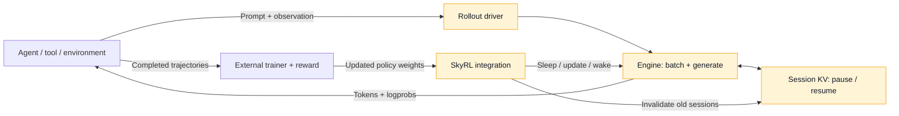

<div align="center">


<h1>qwen3-runtime</h1>

<h3>A compact single-GPU rollout inference engine for Qwen3</h3>

<p>Retain KV across tool calls · Batch concurrent trajectories · Integrate with SkyRL</p>

<p>
  <a href="LICENSE"></a>
  <a href="pyproject.toml"></a>
  <a href="docs/pins/Qwen3-4B/config.json"></a>
  <a href="TEST_RESULTS.md"></a>
</p>

<p>
  <a href="#quick-start">Quick start</a> · <a href="#architecture">Architecture</a> · <a href="#rollout-results">Rollout results</a> · <a href="#performance">Serving curves</a> · <a href="README.zh-CN.md">简体中文</a>
</p>

</div>


---

`qwen3-runtime` implements the inference side of multi-turn agent rollouts:
generate an action, retain session KV during tool execution, then continue from
the appended observation. A shared driver batches concurrent trajectories;
a SkyRL integration connects generation to the training lifecycle.

The project targets Qwen3 on a single GPU. CodeScout-4B code-localization
trajectories provide the reference workload. The implementation is intended for
rollout systems research, with explicit boundaries between model execution,
scheduling, state management, and integration code.

## Core capabilities

| Capability | Implementation |
|---|---|
| Persistent session KV | Pause between turns; reuse exact token prefixes and prefill the appended suffix. Divergent histories restart instead of reusing incompatible state. |
| Optional CPU KV | Bounded synchronous snapshots for paused sessions; version checks, capacity fallback, and explicit completion cleanup. Disabled by default. |
| Concurrent rollouts | A shared engine driver admits asynchronous turns into continuous batches, with chunked prefill, paged KV, and memory-aware scheduling. |
| Sampling and logprobs | Temperature, top-k/top-p/min-p, penalties, seeded sampling, and per-token logprobs; rollout outputs keep token and logprob lengths aligned. |
| Speculative decoding | N-gram proposals verified by the target model, with rejected KV rolled back. |
| Training lifecycle | SkyRL adapter interfaces for generation, sleep/wake, weight updates, abort, and session cleanup. Old sessions are released before policy weights change. |
| Inference interfaces | `LLM.generate()` / `LLM.session()`, plus an OpenAI-compatible CodeScout adapter. |

<a id="rollout-results"></a>

## What the rollout mechanisms changed

### Optional CPU KV offload: a capacity-dependent result

In three-repeat, fixed-token diagnostics, 24 clients sharing a **26.40 GiB** KV
pool completed in **58.95 s** with CPU offload versus **66.80 s** for the faster
GPU control (APC-only): **11.75% less time**, with **31.44% fewer prefill tokens**.
At 4 clients with completed sessions released, or with a larger 33.47 GiB GPU
pool, neither arm needed CPU transfers and timing differences were below 0.2%.

CPU offload stays **opt-in**. Target-dtype loading reduced measured loading peak
from 15.87 to 7.61 GiB; that extra capacity benefits the GPU baseline too.
These are source-hashed exploratory replays with synthetic tool delay,
**not new complete GRPO training results**.
[Configuration, all repetitions, and limitations](SESSION_CPU_OFFLOAD.md).

### Session KV versus APC: four-arm diagnostics


The four controls separate **session continuation** from **content-addressed
prefix reuse**. In this historical, no-tool-dwell replay, Session KV removes
substantial repeated prefill relative to no reuse, but APC alone is competitive
and faster in several cells. At concurrency 16, adding APC to Session KV lowers
later-turn prefill from **221,445 to 161,482 tokens**; APC alone uses 161,811.
The combined arm therefore helps sessions recover reusable prefixes, without
establishing an advantage over APC alone.


The sequential records show the same pattern: Session KV processes **1.304M**
later-turn prefill tokens versus **5.284M** without reuse; APC processes 1.307M.
The recorded times are shown for transparency, **not as validated benchmarks**:
source flags are `dirty=true` and `forced_length_ok=false`, warmup differs across
arms, and there is only one run each. Both experiments use spec=0 and omit tool
dwell time; they cannot establish live-GRPO capacity or current-default speedup.

**The advantage we can defend is explicit state management for trajectories:**
pause and resume a known session, reuse its exact continuation, and release its
state at completion or policy updates. APC can complement this lifecycle by
recovering cached prefixes. The measurements support avoiding repeated prefill;
they do not show a universal speed advantage over APC. Parking, eviction, and
cache pressure remain tradeoffs rather than free gains.
[Full conditions, validity flags, and data](RESULTS.md#kv-four-arm-diagnostics).

### Keep session KV across tool calls


In one archived CodeScout GRPO step (8 prompts × 8 samples), the session-enabled
integration reduced the recorded generation phase from **513.35 to 408.68 s**
(**1.26×**). The complete step changed from **1844.14 to 1732.44 s** (**1.064×**):
generation improvements do not translate one-for-one into training speedup.
The enabled arm reused 1.63M prompt tokens across 223 resumed turns.

This is a **historical integration observation**, not an isolated full-step KV
ablation: the enabled revision also offloads weights during sleep. One step,
one seed, differing sampled trajectories; no training-quality or current-release
performance claim.

### Batch the turns that GRPO generates concurrently


With session KV enabled in both arms, the same-build control admits one turn
at a time; the batched arm lets turns share a step. The recorded generation
span fell **380.67 → 289.34 s** (**1.32×**), while engine steps fell
**28,753 → 12,840** and mean batch rose **1.00 → 2.26**. Request-step totals
remained close (28,753 versus 28,991); the driver performed comparable decode
work in fewer engine steps.

The span includes tool execution between the first admitted and last retired
turn. It excludes parts of the SkyRL generation timer above, so **the two
speedups must not be multiplied**. These are single-run observations with 299
versus 297 turns, not a controlled identical-token replay.
[Evidence provenance, limitations, and plotting script](RESULTS.md#rollout-feature-observations).

<a id="performance"></a>

## Performance at a glance


**More KV helps overloaded sessions, but does not remove the latency boundary.**
In this historical sweep, both allocations stay within the recorded p99 limits
through N=6 among the measured points. At N=8, both exceed the TTFT and TPOT
limits; extra KV preserves more goodput beyond that point. These are two memory
allocations on the **same GPU**, not a comparison of two GPU models.

Each point is one measured five-turn-per-session run. Goodput counts turns
meeting **both TTFT ≤ 4.5 s and TPOT ≤ 100 ms**, divided by measured wall time.
The TTFT panel uses a log scale. Small samples (5–60 turns) limit tail estimates;
this is historical evidence, not a current-release capacity guarantee.
[Metric definitions, raw data, and reproduction](RESULTS.md#performance-figures).

<a id="quick-start"></a>

## Quick start

### 1. Install and try the CPU example

From the repository root:

```bash
uv sync --frozen --all-extras
```

Run the following with `uv run python`. It uses a tiny **randomly initialized**
model to demonstrate the API and KV lifecycle; its output is token IDs, not
useful language generation.

```python
from qwen3_runtime import LLM, SamplingParams

llm = LLM()  # Tiny random model on CPU; no weights to download.
greedy = SamplingParams(temperature=0.0)
print(llm.generate([1, 2, 3], sampling=greedy, max_tokens=3))

with llm.session() as session:
    prompt_ids = [1, 2, 3]
    session.turn(prompt_ids, sampling=greedy, max_tokens=2)
    # Keep the exact generated IDs, then append a toy observation token.
    next_prompt_ids = prompt_ids + session.last_tokens + [7]
    session.turn(next_prompt_ids, sampling=greedy, max_tokens=2)
    print(session.report())
```

Pass the complete token history to each `session.turn()`. The second history
must contain the exact prior prompt and generated IDs followed by new input to
reuse held KV. `session.report()` reports reuse; leaving the context releases
the session. Re-encoding rendered chat text can change the prefix and trigger
a full prefill. The example uses token IDs to make that boundary explicit.

`LLM.generate()` is a simple synchronous facade. Concurrent trajectory batching
is provided by the rollout driver used by the SkyRL adapter; passing a list of
prompts to the facade does not itself demonstrate concurrent batching.

### 2. Use model weights

Model weights are not included. Inspect the download options and point to a
compatible pinned Qwen3-4B directory:

```bash
uv run python scripts/fetch_model.py --help
export QWEN3_RUNTIME_MODEL=/path/to/Qwen3-4B
uv run python scripts/gpu_ready.py
```

```python
import os
from transformers import AutoTokenizer
from qwen3_runtime import LLM, SamplingParams

model_dir = os.environ["QWEN3_RUNTIME_MODEL"]
llm = LLM(model_dir, tokenizer=AutoTokenizer.from_pretrained(model_dir))
print(llm.generate("Explain what a KV cache stores.",
                   sampling=SamplingParams(temperature=0.0), max_tokens=64))
```

Supply a tokenizer for text input. Full-model GPU execution requires a suitable
CUDA/PyTorch environment and sufficient model and KV memory. The factory selects
FlashInfer on CUDA when installed, otherwise PyTorch; Triton is an explicitly
selectable backend. `--all-extras` installs the declared development and
correctness dependencies, **not FlashInfer, Ray, or SkyRL**. Accelerated and
training environments need their own compatible dependencies.

### 3. Verify or benchmark

```bash
uv run --frozen python -m pytest tests -q
uv run python -m bench.run_bench \
  --case decode --scale full --engine qwen3-runtime \
  --model "$QWEN3_RUNTIME_MODEL" --out /tmp/qwen3-runtime_decode.json
```

Tests can run on CPU with resource-dependent checks skipped. Full-scale
benchmarks require the corresponding hardware and weights and reject a dirty
Git worktree by default. See [bench/CONTRACT.md](bench/CONTRACT.md).

<a id="architecture"></a>

## Architecture and training integration



Highlighted components live in this repository. The external trainer controls
when to update the policy; the integration exposes weight-update and lifecycle
hooks, and the runtime manages the affected inference state. KV from an older
policy must not survive into generation under new weights.

The [SkyRL adapter](qwen3_runtime/integrations/skyrl/inference_engine.py) exposes
`generate`, `chat_completion`, `sleep`, `wake_up`, `update_named_weights`, and
`abort_generation`. [Factory injection](qwen3_runtime/integrations/skyrl/inject.py)
provides `patch_skyrl_factory()` for a compatible SkyRL entrypoint before it
creates inference engines. Ray and SkyRL are external dependencies; this is an
integration entrypoint, not a self-contained training launch command.

The engine does not implement the RL algorithm, reward, agent planner, tool
sandbox, or multi-tenant gateway. Integration behavior has CPU regression
coverage; the latest public verification did not run a full SkyRL training job.

<a id="results"></a>

## Evidence and measurement scope

### Frozen serving baseline

The retained measurements below come from **historical clean revisions**, on
the recorded RTX 4090-class 48 GiB environment with Qwen3-4B BF16. They are not a
GPU performance revalidation of the current source snapshot.


Bars show the median of three trials; whiskers retain the measured min–max
range, including the prefill-shaped run's variability. Each panel has its own
zero-based scale. These are different workloads, not points on one scaling curve.

| Measurement | qwen3-runtime | vLLM 0.27.1 | Relative |
|---|---:|---:|---:|
| Closed-batch output throughput, six workloads | — | — | 94.70–97.70% |
| Six-session SLO goodput | 1.355 req/s | 1.398 req/s | 96.9% |

[RESULTS.md](RESULTS.md) records the measurement contract, exact environment,
and raw JSON links. These serving measurements do not establish an end-to-end
training speedup or reward improvement.

### Reference workload

The retained summaries describe 494 CodeScout tasks and 2,395 model calls:

| Characteristic | Observation |
|---|---:|
| Median calls per task | 5 |
| Median input / output tokens | 9,981 / 87 |
| Adjacent turns with exact append-only input histories | 1,901 / 1,901 |
| Prompt tokens potentially reusable across turns | 70.6% |

The append-only count describes **input-history structure**, not output
correctness. The reuse percentage describes workload opportunity, not measured
speedup or guaranteed cache hits. Compact summaries live under
[workloads/code_localization/](workloads/code_localization/); raw replay token
corpora and model weights are not distributed.

## Verification and limits

The latest [test record](TEST_RESULTS.md) reports **362 passed, 24 skipped** on
CPU and a successful wheel/source build. Coverage includes session isolation,
CPU KV save/restore and admission, explicit completion, weight invalidation,
token/logprob alignment, sampling, and speculative commit/rollback.
Skipped checks require optional GPU, model, backend, or replay-token resources.
Separate [GPU offload validation](SESSION_CPU_OFFLOAD.md) is recorded with its
scope; no new complete GRPO training result is claimed.

## Repository map

| Path | Responsibility |
|---|---|
| [llm.py](qwen3_runtime/llm.py) | Synchronous generation and session facade |
| [engine/](qwen3_runtime/engine/) | Scheduling, request lifecycle, model runner, weight handling |
| [rollout/](qwen3_runtime/rollout/) | Concurrent driver, sessions, lifecycle, logprob handling |
| [integrations/skyrl/](qwen3_runtime/integrations/skyrl/) | Training adapter, Ray actor, factory integration |
| [attention/](qwen3_runtime/attention/) | PyTorch, FlashInfer, and Triton attention backends |
| [serving/](qwen3_runtime/serving/) | Protocol helpers, detokenization, SLO harness |
| [CodeScout server](scripts/codescout_openai_server.py) | OpenAI-compatible HTTP adapter |
| [bench/](bench/) · [tests/](tests/) | Measurement harnesses and correctness checks |

---

Rollout systems research · [Apache License 2.0](LICENSE) · [简体中文](README.zh-CN.md)
