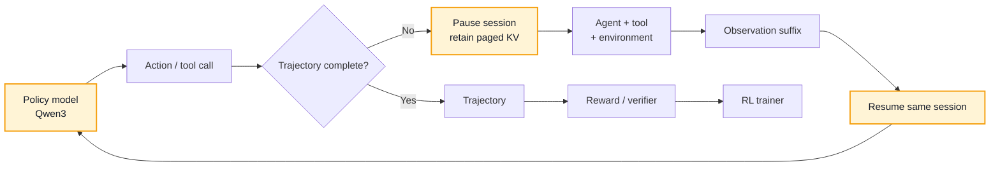

<div align="center">


<h1>qwen3-runtime</h1>

<h3>Rollout inference for Agentic RL and multi-turn code agents</h3>

<p>
  Keep model state alive across tool calls.<br>
  Make trajectory generation cheaper, measurable, and easier to reason about.
</p>

<p>
  <a href="LICENSE"></a>
  <a href="pyproject.toml"></a>
  <a href="docs/pins/Qwen3-4B/config.json"></a>
  <a href="TEST_RESULTS.md"></a>
  <a href="RESULTS.md"></a>
</p>

<p>
  <a href="#positioning">Positioning</a> ·
  <a href="#architecture">Architecture</a> ·
  <a href="#design">Design</a> ·
  <a href="#workload">Workload</a> ·
  <a href="#results">Results</a> ·
  <a href="#quick-start">Quick start</a> ·
  <a href="README.zh-CN.md">简体中文</a>
</p>

</div>

---

<a id="positioning"></a>

## Positioning

> [!IMPORTANT]
> `qwen3-runtime` is the **inference layer of the Agentic RL rollout loop**—not
> another general-purpose model server.

Agentic RL does not train on isolated chat completions. It generates
**trajectories**: a policy model produces an action, an agent executes a tool,
the environment returns an observation, and the same model session continues
with a longer context. This loop repeats until the trajectory can be scored and
used for training.

The runtime targets our own Qwen3-based code-localization policy model. Public
evaluation uses **CodeScout-4B as a reproducible reference workload**; CodeScout
is not the product identity. On one GPU, the runtime retains session KV while
the agent is using tools, resumes from the appended suffix, and applies
target-verified speculative decoding to the short generation bursts common in
agent trajectories.

The systems objective is therefore different: optimize the cost of producing a
complete rollout, not only the latency of one completion.

<table>
  <tr>
    <th align="center">Serving foundation</th>
    <th align="center">Reusable context</th>
    <th align="center">Exact continuations</th>
    <th align="center">Verification</th>
  </tr>
  <tr>
    <td align="center"><strong>94.70–97.70%</strong><br><sub>of vLLM throughput</sub></td>
    <td align="center"><strong>70.6%</strong><br><sub>of prompt tokens</sub></td>
    <td align="center"><strong>1,901 / 1,901</strong><br><sub>adjacent turns</sub></td>
    <td align="center"><strong>175 passed</strong><br><sub>16 resource skips</sub></td>
  </tr>
</table>

### Why rollout inference is different

| Conventional stateless serving | Agentic rollout inference |
|---|---|
| Requests are treated independently | Multiple model calls belong to one trajectory and session |
| State is released after generation | KV remains resident while the agent executes a tool |
| The next request submits another full prompt | The next turn usually appends only a new observation |
| Main view: request latency and tokens/s | Main view: trajectory cost, tail latency, trajectories/GPU-hour |
| Sampling ends at the response boundary | Sampling remains correct across repeated pause/resume cycles |

<a id="architecture"></a>

## Rollout architecture



The runtime owns the highlighted inference state. Agent planning, tools,
environment execution, trajectory storage, reward, and training stay outside
the engine.

<a id="design"></a>

## Designed around the rollout loop

| Mechanism | Why it matters for rollouts |
|---|---|
| **Persistent session KV** | A completed turn enters `PAUSED` instead of releasing paged KV. After tool execution, `resume_request` prefills only the last uncomputed action token and the appended observation. |
| **Target-verified speculation** | N-gram prompt lookup proposes tokens; the Qwen3 policy verifies them before commit. Rejected KV is rolled back, so speculation does not become an approximate policy. |
| **Rollout sampling semantics** | Temperature, top-k, top-p, stop/EOS handling, and per-session RNG live in the engine. |
| **Concurrent trajectory serving** | Continuous batching, chunked prefill, paged KV, memory-aware admission, and preemption support multiple active rollouts. |
| **Narrow Agent boundary** | The core speaks token IDs. A thin OpenAI-compatible adapter handles chat templates and tool-call mapping without absorbing the Agent stack. |
| **Training-oriented correctness** | Tests cover greedy equivalence, sampling distribution, session isolation, KV release, pause/resume equivalence, and speculative commit/rollback. |

<a id="workload"></a>

## Workload that shaped the design

The reproducible reference is CodeScout-4B on code-localization trajectories.
The frozen public workload contains **494 tasks** and **2,395 model calls**.

| Rollout characteristic | Observed value |
|---|---:|
| Median model calls per task | **5** |
| Median request shape | **9,981 input / 87 output tokens** |
| Exact append-only adjacent turns | **1,901 / 1,901** |
| Prompt tokens reusable through session continuation | **70.6%** |

These are long-context, short-output, multi-turn sessions—not unrelated
prompts. That workload shape is why session-persistent KV is the central
abstraction. Compact evidence is retained under
[`workloads/code_localization/`](workloads/code_localization/).

<a id="results"></a>

## Serving foundation and results

Rollout-specific mechanisms sit on a complete, independently owned Qwen3
serving path:

```text
request/session lifecycle
        ↓
continuous batching + chunked prefill + preemption
        ↓
paged KV + FlashInfer paged attention
        ↓
Qwen3 model execution + sampling + speculative verification
        ↓
CUDA Graph decode / eager split-KV long-context fallback
```

On the recorded RTX 4090-class 48 GiB environment with Qwen3-4B BF16:

| Measurement | qwen3-runtime | vLLM 0.27.1 | Relative |
|---|---:|---:|---:|
| Closed-batch output throughput, six workloads | — | — | **94.70–97.70%** |
| Six-session SLO goodput | **1.355 req/s** | **1.398 req/s** | **96.9%** |

These measurements establish the serving baseline; matching vLLM is not the
project identity. The unit of optimization is an **Agentic RL trajectory**.
See [RESULTS.md](RESULTS.md) for the full table, scope, environment, and retained
raw JSON.

## Repository map

| Path | Responsibility |
|---|---|
| [`qwen3_runtime/`](qwen3_runtime/) | Model execution, scheduler, paged KV, sampling, session state, speculation |
| [`scripts/codescout_openai_server.py`](scripts/codescout_openai_server.py) | Loopback CodeScout/OpenAI-compatible rollout adapter |
| [`bench/`](bench/) | Closed-batch, SLO, session-capacity, and replay harnesses |
| [`tests/`](tests/) | CPU invariants, reference checks, session/speculation tests, GPU checks |
| [`workloads/code_localization/`](workloads/code_localization/) | Compact reproducible rollout workload evidence |
| [`bench/results/`](bench/results/) | Selected clean benchmark artifacts |

<a id="quick-start"></a>

## Quick start

### 1. Install

```bash
uv sync --frozen --all-extras
```

Model weights are not included. Fetch the pinned model or point
`QWEN3_RUNTIME_MODEL` to a compatible local directory:

```bash
uv run python scripts/fetch_model.py --help
export QWEN3_RUNTIME_MODEL=/path/to/Qwen3-4B
uv run python scripts/gpu_ready.py
```

### 2. Verify

```bash
uv run --frozen python -m pytest tests -q
```

The latest exported record is in [TEST_RESULTS.md](TEST_RESULTS.md). GPU and
full-model checks require the corresponding hardware and weights.

### 3. Run a benchmark

```bash
uv run python -m bench.run_bench \
  --case decode \
  --scale full \
  --engine qwen3-runtime \
  --model "$QWEN3_RUNTIME_MODEL" \
  --out /tmp/qwen3-runtime_decode.json
```

Full-scale benchmarks reject a dirty Git worktree by default. The frozen
measurement contract is documented in [bench/CONTRACT.md](bench/CONTRACT.md).

## Scope and integration contract

`qwen3-runtime` owns token generation, sampling, request/session lifecycle,
paged KV, batching, and speculative verification. It does **not** implement the
RL algorithm, trainer, reward model, Agent planner, sandbox, or a multi-tenant
API gateway.

Training-side weight synchronization and policy-version ownership remain
integration responsibilities. Retained KV is valid only for the exact policy
weights that created it.

---

<div align="center">

<p>
  Built for rollout systems research · Apache License 2.0 ·
  <a href="RESULTS.md">Results</a> ·
  <a href="TEST_RESULTS.md">Tests</a> ·
  <a href="README.zh-CN.md">中文</a>
</p>

</div>
