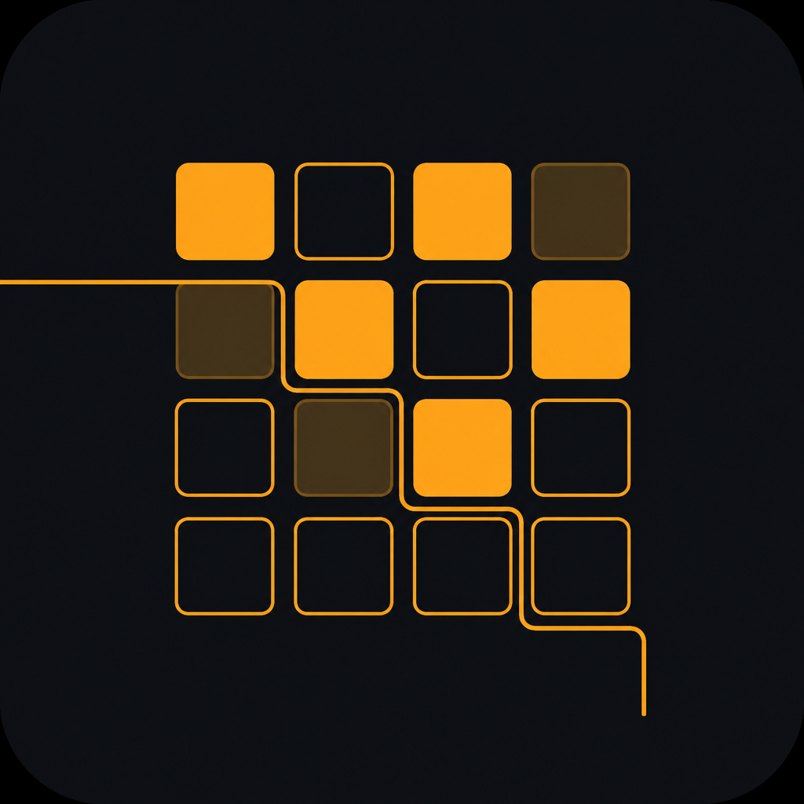
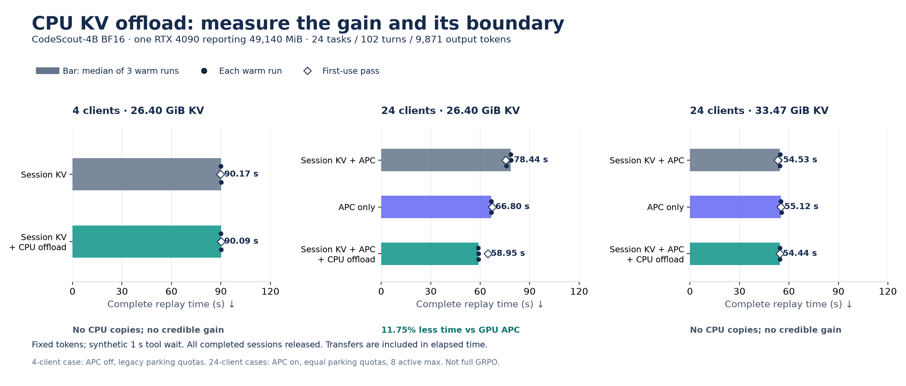
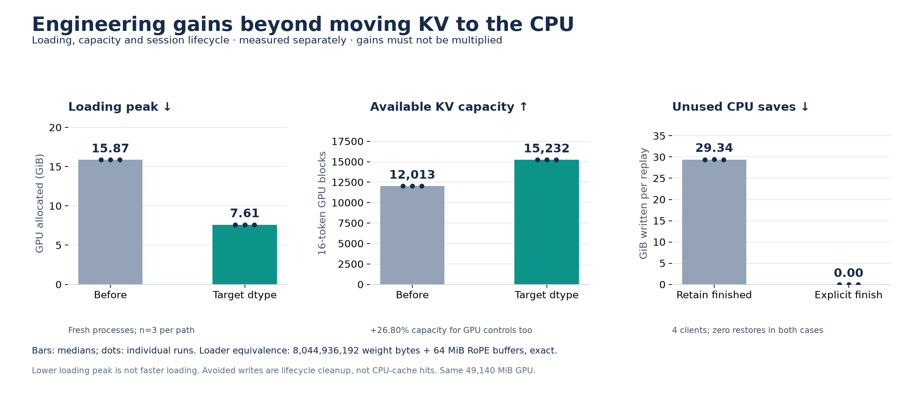
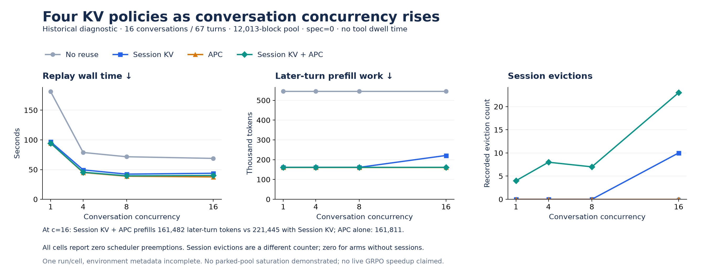
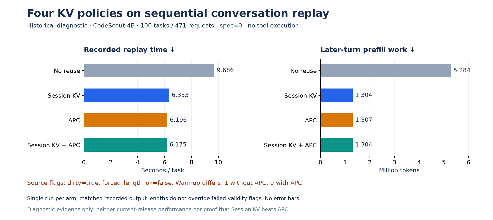
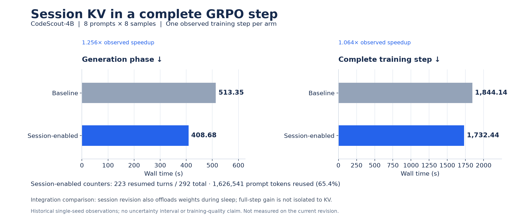
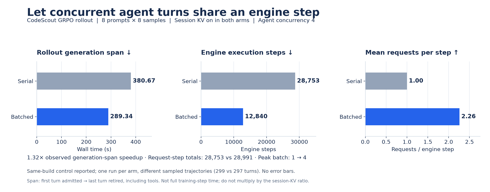
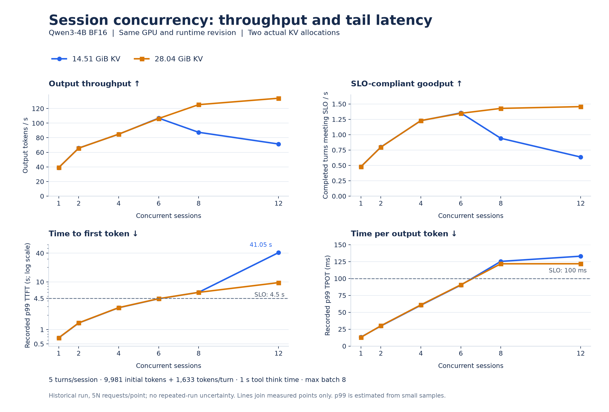
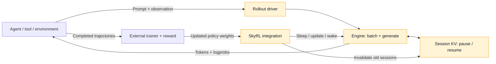
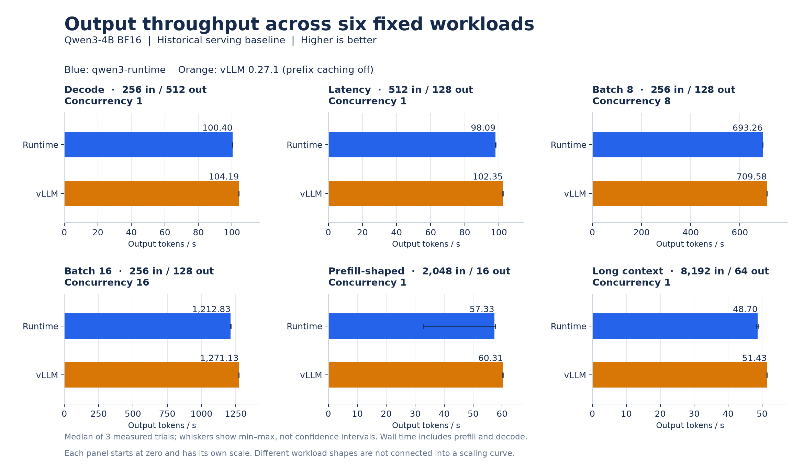

<div align="center">



<h1>qwen3-runtime</h1>

<h3>面向 Qwen3 的紧凑型单 GPU rollout 推理引擎</h3>

<p>跨工具调用保留 KV · 并发轨迹生成 · SkyRL 训练集成</p>

<p>
  <a href="LICENSE"></a>
  <a href="pyproject.toml"></a>
  <a href="docs/pins/Qwen3-4B/config.json"></a>
  <a href="TEST_RESULTS.md"></a>
</p>

<p>
  <a href="#quick-start">快速开始</a> · <a href="#architecture">架构与集成</a> · <a href="#rollout-results">Rollout 收益</a> · <a href="#performance">Serving 曲线</a> · <a href="README.md">English</a>
</p>

</div>


---

`qwen3-runtime` 实现多轮 Agent rollout 的推理部分：生成 action，在工具执行期间
保留 session KV，再从新增 observation 继续生成。统一的 driver 将并发 trajectory
送入共享 batch，SkyRL 集成层连接推理与训练生命周期。

项目面向单 GPU 上的 Qwen3，以 CodeScout-4B 代码定位轨迹作为参考 workload，
用于 rollout 系统研究。模型执行、调度、状态管理与集成代码各自保持明确边界。

## 核心能力

| 能力 | 实现方式 |
|---|---|
| 跨轮次保留 KV | 生成后暂停 session，复用精确的 token 前缀，仅 prefill 新增后缀；历史不一致时重新计算。 |
| 可选 CPU KV | 对暂停 session 使用有界同步快照，检查版本、处理容量不足，并支持显式结束清理；默认关闭。 |
| 并发 rollout | 统一 engine driver 接收异步请求，通过 continuous batching、chunked prefill、Paged KV 与内存感知调度执行。 |
| 采样与 logprob | 支持 temperature、top-k/top-p/min-p、penalty、带 seed 的采样与逐 token logprob；rollout 输出保持 token 和 logprob 数量一致。 |
| 推测解码 | 由目标模型验证 n-gram 候选，回滚未接受部分的 KV。 |
| 训练生命周期 | SkyRL 适配器提供生成、sleep/wake、权重更新、中止与 session 清理接口；更新策略权重前释放旧 session。 |
| 推理入口 | `LLM.generate()` / `LLM.session()`，以及兼容 OpenAI 协议的 CodeScout 适配器。 |

<a id="rollout-results"></a>

## Rollout 机制带来的实际变化

### 可选 CPU KV offload：展示收益，也验证边界



**固定容量压力下，回放耗时降低 11.75%，prefill 减少 31.44%。**
24 个客户端共享 26.40 GiB GPU KV 池时，**Session KV + APC + 同步 CPU offload**
耗时 **58.95 s**，
同配置较快的 GPU 对照（纯 APC）为 **66.80 s**。图中同时展示三组对照、
每次正式测量和首次运行。

24 客户端实验已经包含三者组合，实际开关如下：

| 原始组名 | Session KV | APC | CPU offload | 固定池耗时中位数 |
|---|---|---|---|---:|
| `B11` | 开 | 开 | 关 | 78.44 s |
| `apc-only` | 关 | 开 | 关 | 66.80 s |
| `O-sync` | 开 | 开 | 同步 | **58.95 s** |

在 **Session KV + APC** 上加入 offload，耗时降低 **24.84%**；标题采用更强的
纯 APC 对照，因此报告 **11.75%**。这里测的是完整组合。4 客户端诊断关闭了
APC，所以图中按具体实验标注方案；公开数据也保存了各组开关。

4 并发并清理结束轨迹后，或将 GPU 池扩大到
33.47 GiB 后，没有 CPU 搬运，**没有可信的 offload 加速**。

测量使用 CodeScout-4B BF16、一张报告 **49,140 MiB** 显存的 RTX 4090、
24 条已记录任务 / 102 轮 / 9,871 个固定输出 token、合成 1 s 工具等待，
每组 n=3 正式重复。这是带源码摘要的探索性回放，**不是零售版 24GB 卡的测量，
也不是新一轮完整 GRPO 训练结果**。Offload 保持**默认关闭**。



这部分工作还改善了周边系统：

- **目标精度加载：** GPU 加载峰值 **15.87 → 7.61 GiB**，自动 KV 容量
  **12,013 → 15,232 块（+26.80%）**。容量收益也属于 GPU 对照，不宣称加载提速。
- **明确的轨迹结束通知：** 4 并发回放中，无效 CPU 写入从 **29.34 → 0 GiB**。
  两组都没有恢复，收益来自及时清理，不能计作 CPU 缓存命中。
- **安全的状态迁移：** 快照版本检查、事务式恢复、容量准入，以及超大快照的
  提前拒绝。权重变化使旧 KV 失效；结束、取消和睡眠回收对应状态。
- **可审计的测量：** 保存实际配置、源码与轨迹摘要、有效恢复、传输耗时和字节账目。

**验证证据：下列计数口径不同，不能相加为一个“测试总数”。**

| 检查 | 已记录证据 | 说明了什么 |
|---|---|---|
| 公开版 CPU 测试 | **365 通过 / 24 跳过**；[测试摘要](TEST_RESULTS.md) | 公开源码行为；依赖可选资源的检查仍跳过 |
| 历史 CUDA 测试 | **6 通过**；[验证记录](bench/results/session-cpu-offload/verification.json) | 真实 GPU 的保存、恢复与 offload 路径 |
| 非强制输出的模型检查 | **16 个样本**，前缀 128–16,384 token；[逐项记录](bench/results/session-cpu-offload/verification.json) | KV 逐位一致；与 GPU 保留路径的续写及 logprob 一致 |
| 回放审计 | **58 次执行**，含重复组与首次运行；[审计记录](bench/results/session-cpu-offload/verification.json) | 源码/轨迹关联、字节守恒及最终清理；不是 58 个独立工作负载 |
| 加载等价性 | **8.04 GB 权重 + 64 MiB RoPE** 完全相等；[记录](bench/results/session-cpu-offload/observations.json) | 降低峰值后，检查过的完整模型状态不变 |
| Ray 生命周期 | 实际生成 → 结束 → 睡眠/唤醒；[记录](bench/results/session-cpu-offload/observations.json) | 合成轨迹返回包下的适配集成，不等于完整 GRPO |

公开 CPU 测试与历史 GPU 检查是不同批次。公开数据提供四组主要实验的
**40 条逐次记录**，另以检查级审计覆盖 18 次辅助执行；不分发私有轨迹和操作日志。
完整冷重算与 GPU 保留路径之间仍可能存在数值差异。
[实现、适用范围与复现方式](SESSION_CPU_OFFLOAD.md) ·
[绘图脚本](scripts/plot_session_offload.py) ·
[图表数值及来源摘要](docs/assets/performance/offload-figure-data.json)。

### Session KV 与 APC：四组对照说明了什么



四组对照把**同一 session 的续接**与**按内容匹配的前缀复用**分开。在这组没有
工具等待时间的历史 replay 中，Session KV 相比不缓存显著减少重复 prefill，
但纯 APC 同样有效，且在若干配置下更快。并发 16 时，Session KV 叠加 APC 将
后续轮次 prefill 从 **221,445 降到 161,482 token**；纯 APC 为 161,811。
组合策略能缓解 session 驱逐后的重算，但没有证明它比纯 APC 更快。



顺序实验也呈现相同趋势：Session KV 的后续轮次 prefill 为 **130.4 万 token**，
不缓存为 **528.4 万**，纯 APC 为 130.7 万。耗时保留展示，但**不作为已验证的
性能基准**：原始记录为 `dirty=true`、`forced_length_ok=false`，各组 warmup
不同，且每组只有一次测量。两组实验都是 spec=0、没有真实工具等待，不能代表
当前默认配置的加速，也没有验证真实 GRPO 的容量边界。

**我们更有依据的优势，是围绕 trajectory 管理明确的会话状态**：暂停与续接同一
session，复用精确延续的 KV，在结束或策略权重更新时释放状态。APC 可以作为
补充，恢复仍可复用的前缀。这些数据支持“减少重复 prefill”，不支持“普遍快于
APC”；驻留、驱逐与缓存压力仍需要权衡。
[完整条件、有效性标记与原始字段](RESULTS.md#kv-four-arm-diagnostics)。

### 在工具调用之间保留 session KV



一组归档 CodeScout GRPO 实验使用 8 个 prompt、每个采样 8 条轨迹。启用 session
的集成版本把生成阶段从 **513.35 s 降到 408.68 s（1.26×）**，完整 step 从
**1844.14 s 降到 1732.44 s（1.064×）**。生成更快并不会等比例地缩短整个训练
step；启用组在 223 个 resumed turn 中复用了约 163 万 prompt token。

这是**历史集成实验**：启用组还包含 sleep 时卸载权重的改动，不能把完整 step
的收益全部归因于 KV。每组只有一个 step、一个 seed，采样轨迹也有差异，不作为
训练质量或当前版本性能的证明。

### 让 GRPO 的并发 turn 真正进入同一个 batch



两边都开启 session KV；同一 build 的串行对照每次只接纳一个 turn，批处理组允许
多个 turn 共享 engine step。实测生成区间 **380.67 → 289.34 s（1.32×）**，
引擎步数 **28,753 → 12,840**，平均 batch **1.00 → 2.26**。Request-step
总量接近（28,753 与 28,991），体现的是把相近的 decode 工作合并到更少的引擎步骤中。

这个计时区间从首次接纳 turn 到最后一个 turn 结束，包含中间的工具执行，
与上面的 SkyRL generation timer 边界不同，**两项加速比不能相乘**。
它也是单次观测，分别产生 299 和 297 个 turn，不是逐 token 相同的 replay。
[证据来源、限制与绘图脚本](RESULTS.md#rollout-feature-observations)。

<a id="performance"></a>

## 性能一览



**增加 KV 能缓解过载时的吞吐下降，但没有消除延迟边界。** 在这组历史扫描的
已测点中，两档内存预算到 N=6 时仍满足记录的 p99 阈值；到 N=8 时，两者的
TTFT 和 TPOT 都越界，更多 KV 则保住了更多 goodput。两条线是**同一 GPU 的
两档 KV 分配量**，不是两款 GPU 的性能对比。

每个点来自一轮实测，每个 session 运行五个 turn。Goodput 是同时满足
**TTFT ≤ 4.5 s 且 TPOT ≤ 100 ms** 的 turn 数除以测量总耗时。TTFT 图使用
对数轴；每点只有 5–60 个 turn，尾延迟估计受样本量限制。这是历史测量，
不是当前版本的容量保证。[指标定义、原始数据与复现方式](RESULTS.md#performance-figures)。

<a id="quick-start"></a>

## 快速开始

### 1. 安装并运行 CPU 示例

在仓库根目录执行：

```bash
uv sync --frozen --all-extras
```

通过 `uv run python` 运行以下代码。示例使用**随机初始化的微型模型**，演示接口和
KV 生命周期；输出是 token ID，不具备实际语言生成能力，也不需要下载模型。

```python
from qwen3_runtime import LLM, SamplingParams

llm = LLM()  # Tiny random model on CPU; no weights to download.
greedy = SamplingParams(temperature=0.0)
print(llm.generate([1, 2, 3], sampling=greedy, max_tokens=3))

with llm.session() as session:
    prompt_ids = [1, 2, 3]
    session.turn(prompt_ids, sampling=greedy, max_tokens=2)
    # Keep the exact generated IDs, then append a toy observation token.
    next_prompt_ids = prompt_ids + session.last_tokens + [7]
    session.turn(next_prompt_ids, sampling=greedy, max_tokens=2)
    print(session.report())
```

每次 `session.turn()` 都传入完整 token 历史。要复用已有 KV，第二轮必须精确保留
上一轮的 prompt 和生成 token，再追加新输入。`session.report()` 展示复用统计，
退出上下文会释放 session。把渲染后的聊天文本重新编码可能改变前缀并触发完整
prefill，因此示例直接使用 token ID 明确展示这一约束。

`LLM.generate()` 是同步易用入口。并发 trajectory 的批处理由 SkyRL 适配器使用的
rollout driver 提供；向该同步入口传入 prompt 列表并不等于并发批处理。

### 2. 使用模型权重

仓库不包含权重。查看下载参数，并指向符合 pin 配置的 Qwen3-4B 本地目录：

```bash
uv run python scripts/fetch_model.py --help
export QWEN3_RUNTIME_MODEL=/path/to/Qwen3-4B
uv run python scripts/gpu_ready.py
```

```python
import os
from transformers import AutoTokenizer
from qwen3_runtime import LLM, SamplingParams

model_dir = os.environ["QWEN3_RUNTIME_MODEL"]
llm = LLM(model_dir, tokenizer=AutoTokenizer.from_pretrained(model_dir))
print(llm.generate("Explain what a KV cache stores.",
                   sampling=SamplingParams(temperature=0.0), max_tokens=64))
```

文本输入需要显式提供 tokenizer。完整模型的 GPU 推理需要匹配的 CUDA/PyTorch
环境，以及足够容纳权重和 KV 的显存。Factory 在 CUDA 上优先选择已安装的
FlashInfer，否则使用 PyTorch；也可以显式选择 Triton 后端。`--all-extras` 安装
项目声明的开发与正确性依赖，**不包含 FlashInfer、Ray 或 SkyRL**；加速和训练
环境需要另外准备兼容依赖。

### 3. 验证或运行 benchmark

```bash
uv run --frozen python -m pytest tests -q
uv run python -m bench.run_bench \
  --case decode --scale full --engine qwen3-runtime \
  --model "$QWEN3_RUNTIME_MODEL" --out /tmp/qwen3-runtime_decode.json
```

测试可在 CPU 上执行，依赖额外资源的检查会跳过。完整 benchmark 需要对应硬件和
权重，默认拒绝 dirty Git worktree。测量约定见 [bench/CONTRACT.md](bench/CONTRACT.md)。

<a id="architecture"></a>

## 架构与训练集成



高亮组件位于本仓库。外部 trainer 决定何时更新策略，集成层提供权重更新和
生命周期接口，runtime 管理受影响的推理状态。旧策略生成的 KV 不能沿用到
新权重下的生成过程。

[SkyRL 适配器](qwen3_runtime/integrations/skyrl/inference_engine.py) 提供
`generate`、`chat_completion`、`sleep`、`wake_up`、`update_named_weights` 和
`abort_generation`。[Factory 注入模块](qwen3_runtime/integrations/skyrl/inject.py)
提供 `patch_skyrl_factory()`，可在兼容的 SkyRL 入口创建 inference engine 前调用。
Ray 和 SkyRL 是外部依赖；这里提供集成入口，不是一条独立可运行的训练启动命令。

Engine 不实现 RL 算法、reward、Agent planner、工具 sandbox 或多租户网关。
集成行为有 CPU 回归测试覆盖；最近一次公开验证没有执行完整 SkyRL 训练任务。

<a id="results"></a>

## 测量证据与适用范围

### 冻结的 serving 基线

以下数据来自**历史 clean revision**，使用记录中的 RTX 4090-class 48 GiB 环境
和 Qwen3-4B BF16；它们不代表当前源码快照已经重新完成 GPU 性能验证。



柱长是三次 trial 的中位数，误差线保留实测最小值到最大值，包括 prefill-shaped
负载中的波动。每个子图单独取刻度并从零开始；不同负载不连成一条缩放曲线。

| 测量 | qwen3-runtime | vLLM 0.27.1 | 相对表现 |
|---|---:|---:|---:|
| 六个 closed-batch workload 的 output throughput | — | — | 94.70–97.70% |
| 六 session SLO goodput | 1.355 req/s | 1.398 req/s | 96.9% |

[RESULTS.md](RESULTS.md) 提供测量口径、具体环境和原始 JSON 链接。这些 serving
测量不能用来证明端到端训练加速或 reward 提升。

### 参考 workload

保留的统计摘要描述了 494 个 CodeScout task、2,395 次模型调用：

| 特征 | 观测值 |
|---|---:|
| 每个 task 的调用次数中位数 | 5 |
| 输入 / 输出 token 数中位数 | 9,981 / 87 |
| 输入历史精确满足 append-only 的相邻 turn | 1,901 / 1,901 |
| 跨轮次具有复用潜力的 prompt token | 70.6% |

相邻 turn 数量描述的是**输入历史结构**，不是模型输出正确性。复用比例描述的是
workload 的优化空间，不是实测加速比或保证的缓存命中率。精简统计位于
[workloads/code_localization/](workloads/code_localization/)；原始 replay token
语料和模型权重不随仓库发布。

## 验证与限制

最近一次[测试记录](TEST_RESULTS.md)：CPU 上 **365 通过、24 跳过**，wheel 与源码
包构建成功。测试覆盖 session 隔离、CPU KV 保存/恢复与容量处理、显式结束清理、
权重失效、token/logprob 对齐、采样与 speculative commit/rollback。
跳过项依赖可选 GPU、模型、后端或 replay token 资源。独立的
[GPU offload 验证](SESSION_CPU_OFFLOAD.md) 按实际范围记录；未宣称新的完整 GRPO 训练收益。

## 仓库导航

| 路径 | 职责 |
|---|---|
| [llm.py](qwen3_runtime/llm.py) | 同步生成与 session 入口 |
| [engine/](qwen3_runtime/engine/) | 调度、请求生命周期、模型执行与权重处理 |
| [rollout/](qwen3_runtime/rollout/) | 并发 driver、session、生命周期与 logprob 处理 |
| [integrations/skyrl/](qwen3_runtime/integrations/skyrl/) | 训练适配器、Ray actor 与 factory 集成 |
| [attention/](qwen3_runtime/attention/) | PyTorch、FlashInfer 与 Triton attention 后端 |
| [serving/](qwen3_runtime/serving/) | 协议辅助、detokenization 与 SLO harness |
| [CodeScout server](scripts/codescout_openai_server.py) | 兼容 OpenAI 协议的 HTTP 适配器 |
| [bench/](bench/) · [tests/](tests/) | 测量工具与正确性检查 |

---

Rollout 系统研究 · [Apache License 2.0](LICENSE) · [English](README.md)
