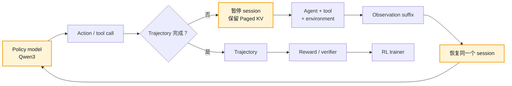

<div align="center">


<h1>qwen3-runtime</h1>

<h3>面向 Agentic RL 与多轮代码 Agent 的 rollout 推理引擎</h3>

<p>
  在工具调用之间保留模型状态。<br>
  让训练轨迹生成更低成本、更可测、更容易理解。
</p>

<p>
  <a href="LICENSE"></a>
  <a href="pyproject.toml"></a>
  <a href="docs/pins/Qwen3-4B/config.json"></a>
  <a href="TEST_RESULTS.md"></a>
  <a href="RESULTS.md"></a>
</p>

<p>
  <a href="#positioning">项目定位</a> ·
  <a href="#architecture">架构</a> ·
  <a href="#design">核心设计</a> ·
  <a href="#workload">Workload</a> ·
  <a href="#results">结果</a> ·
  <a href="#quick-start">快速开始</a> ·
  <a href="README.md">English</a>
</p>

</div>

---

<a id="positioning"></a>

## 项目定位

> [!IMPORTANT]
> `qwen3-runtime` 是 **Agentic RL rollout loop 的推理层**，不是另一个通用模型
> serving 框架。

Agentic RL 生成的不是彼此独立的 chat completion，而是一条条 **trajectory**：策略
模型生成 action，Agent 执行工具，环境返回 observation，同一个模型 session 再带着
更长的上下文继续生成。只有反复完成这个循环后，一条轨迹才能被打分并进入训练。

Runtime 面向我们自己训练的、基于 Qwen3 的代码定位 policy model。公开测试选择
**CodeScout-4B 作为可复现的参考 workload**，CodeScout 并不是项目本身的产品定位。
在单 GPU 上，Runtime 会在 Agent 使用工具期间保留 session KV，下一轮从新增 suffix
恢复，并对 Agent trajectory 中常见的短输出生成使用经目标模型验证的 speculative
decoding。

因此，系统优化目标也不同：关注完整 rollout 的生成成本，而不只是一次 completion
的延迟。

<table>
  <tr>
    <th align="center">Serving 底座</th>
    <th align="center">可复用上下文</th>
    <th align="center">精确连续会话</th>
    <th align="center">测试验证</th>
  </tr>
  <tr>
    <td align="center"><strong>94.70–97.70%</strong><br><sub>vLLM throughput</sub></td>
    <td align="center"><strong>70.6%</strong><br><sub>prompt tokens</sub></td>
    <td align="center"><strong>1,901 / 1,901</strong><br><sub>相邻 turns</sub></td>
    <td align="center"><strong>175 passed</strong><br><sub>16 项资源跳过</sub></td>
  </tr>
</table>

### Rollout 推理与普通 serving 有什么不同

| 普通无状态 serving | Agentic rollout inference |
|---|---|
| 把请求看作彼此独立 | 多次模型调用共同组成一条 trajectory 和一个 session |
| 一次生成结束后释放状态 | Agent 执行工具时继续保留 KV |
| 下一次请求重新提交完整 prompt | 下一轮通常只追加新的 observation |
| 主要关注 request latency 与 tokens/s | 关注 trajectory 成本、tail latency 与 trajectories/GPU-hour |
| 采样在一次 response 结束时终止 | 采样语义跨多次 pause/resume 保持正确 |

<a id="architecture"></a>

## Rollout 架构



高亮节点是 Runtime 负责的推理状态。Agent planning、工具、环境执行、trajectory
存储、reward 和训练都留在 Engine 之外。

<a id="design"></a>

## 围绕 rollout loop 设计

| 机制 | 对 rollout 的意义 |
|---|---|
| **Persistent session KV** | 一轮生成完成后进入 `PAUSED`，而不是释放 Paged KV。工具执行完成后，`resume_request` 只 prefill 上一轮最后一个未计算 action token 和新增 observation。 |
| **Target-verified speculation** | N-gram prompt lookup 提出候选 token，Qwen3 policy 验证后再提交；被拒绝的 KV 会 rollback，因此 speculative path 不会成为近似 policy。 |
| **Rollout sampling semantics** | Engine 原生处理 temperature、top-k、top-p、stop/EOS 与 session 级 RNG。 |
| **并发 trajectory serving** | Continuous batching、chunked prefill、Paged KV、memory-aware admission 和 preemption 支撑多条活跃 rollout。 |
| **窄而清晰的 Agent 边界** | Core 只处理 token ID；轻量 OpenAI-compatible adapter 负责 chat template 与 tool-call 映射，不吸收 Agent stack。 |
| **面向训练的正确性** | 测试覆盖 greedy equivalence、采样分布、session 隔离、KV 释放、pause/resume 等价性与 speculative commit/rollback。 |

<a id="workload"></a>

## 驱动设计的真实 workload

可复现的参考 workload 是 CodeScout-4B 的代码定位 trajectory。冻结公开数据包含
**494 个 task**、**2,395 次模型调用**。

| Rollout 特征 | 观测值 |
|---|---:|
| 每个 task 的模型调用次数中位数 | **5** |
| 请求形状中位数 | **9,981 input / 87 output tokens** |
| Exact append-only 的相邻 turn | **1,901 / 1,901** |
| 可通过 session continuation 复用的 prompt token | **70.6%** |

这些 workload 是长上下文、短输出、多轮延续的 session，而不是一批互不相关的
prompt。这正是 session-persistent KV 成为核心抽象的原因。精简后的证据保留在
[`workloads/code_localization/`](workloads/code_localization/) 下。

<a id="results"></a>

## Serving 底座与结果

Rollout 机制建立在一条完整、独立实现的 Qwen3 serving path 上：

```text
request/session lifecycle
        ↓
continuous batching + chunked prefill + preemption
        ↓
paged KV + FlashInfer paged attention
        ↓
Qwen3 model execution + sampling + speculative verification
        ↓
CUDA Graph decode / eager split-KV long-context fallback
```

在记录的 RTX 4090-class 48 GiB 环境、Qwen3-4B BF16 条件下：

| 测量 | qwen3-runtime | vLLM 0.27.1 | 相对表现 |
|---|---:|---:|---:|
| 六个 closed-batch workload 的 output throughput | — | — | **94.70–97.70%** |
| 六 session SLO goodput | **1.355 req/s** | **1.398 req/s** | **96.9%** |

这些测量证明 serving 底座足够可靠；“追平 vLLM”不是项目定位。项目真正的优化单位
是一条 **Agentic RL trajectory**。完整表格、环境、口径和原始 JSON 见
[RESULTS.md](RESULTS.md)。

## 仓库导航

| 路径 | 职责 |
|---|---|
| [`qwen3_runtime/`](qwen3_runtime/) | 模型执行、Scheduler、Paged KV、Sampling、Session 状态与 Speculation |
| [`scripts/codescout_openai_server.py`](scripts/codescout_openai_server.py) | Loopback CodeScout/OpenAI-compatible rollout adapter |
| [`bench/`](bench/) | Closed-batch、SLO、Session-capacity 与 Replay harness |
| [`tests/`](tests/) | CPU invariance、Reference、Session/Speculation 与 GPU tests |
| [`workloads/code_localization/`](workloads/code_localization/) | 精简、可复现的 rollout workload 证据 |
| [`bench/results/`](bench/results/) | 筛选后的 clean benchmark artifacts |

<a id="quick-start"></a>

## 快速开始

### 1. 安装

```bash
uv sync --frozen --all-extras
```

仓库不包含模型权重。获取 pin 对应的模型，或者把 `QWEN3_RUNTIME_MODEL` 指向兼容
的本地目录：

```bash
uv run python scripts/fetch_model.py --help
export QWEN3_RUNTIME_MODEL=/path/to/Qwen3-4B
uv run python scripts/gpu_ready.py
```

### 2. 验证

```bash
uv run --frozen python -m pytest tests -q
```

最近一次导出记录见 [TEST_RESULTS.md](TEST_RESULTS.md)。GPU 和完整模型检查需要相应
的硬件与权重。

### 3. 运行 Benchmark

```bash
uv run python -m bench.run_bench \
  --case decode \
  --scale full \
  --engine qwen3-runtime \
  --model "$QWEN3_RUNTIME_MODEL" \
  --out /tmp/qwen3-runtime_decode.json
```

完整 benchmark 默认拒绝 dirty Git worktree。冻结的测量规则见
[bench/CONTRACT.md](bench/CONTRACT.md)。

## 范围与集成约束

`qwen3-runtime` 负责 token generation、sampling、request/session lifecycle、
Paged KV、batching 和 speculative verification。它不实现 RL 算法、trainer、
reward model、Agent planner、sandbox 或多租户 API gateway。

训练侧的权重同步和 policy version 管理仍由集成系统负责。保留的 session KV 只能
继续用于生成它时对应的那一版 policy weights。

---

<div align="center">

<p>
  为 rollout systems research 而构建 · Apache License 2.0 ·
  <a href="RESULTS.md">结果</a> ·
  <a href="TEST_RESULTS.md">测试</a> ·
  <a href="README.md">English</a>
</p>

</div>
